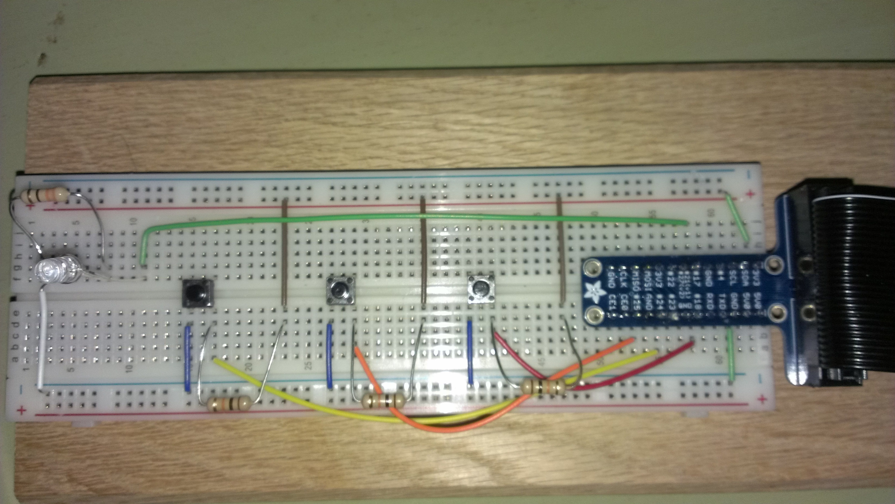

pi-sounds
=========

Building a Soundboard for my Raspberry Pi with various blinkys

        # Input Pin 18 reads a pull-down button that plays a sound and turns on LED on output pin 17
        # then turns the light on output pin 17 off after it's done playing
        
        # Input Pin 24 reads a pull-down button that needs to remember state and toggle LED on output pin 17 on and off
        
        # Input Pin 25 reads a pull-down button that turns on a blinky light on pin 17 and plays a sound ONLY while button is pressed

Breadboard

