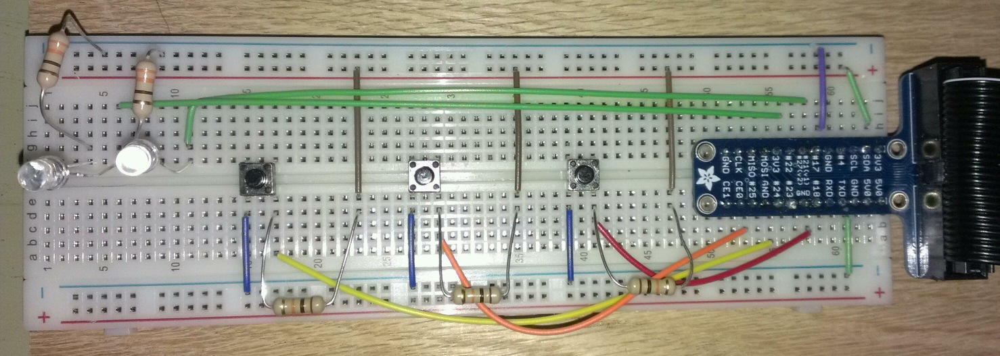

pi-sounds
=========

TODO:
        # Make re-usable functions for the different blinkys that take parameters such as Pin#, Light Pattern, Timing ???
        # Prompt for multiple choice User Input to select the sound-set
        # Use a rotary encoder to change the sounds played
        # Make a standalone PCB with ribbon connector to Pi
        # Make a cool enclosure with powered USB Hub and built-in speaker

Building a Soundboard for my Raspberry Pi with various blinkys

        # Input Pin 18 reads a pull-down button that plays a sound and turns on LED on output pin 17
        # then turns the light on output pin 17 off after it's done playing
        
        # Input Pin 24 reads a pull-down button that cycles through 4 states to toggle LED patternss on output pins 17 and 22: All Off, 17on/22off, 17off/22on, both on
        
        # Input Pin 25 reads a pull-down button that turns on alternating flashing LEDs (like a siren) on pins 17 and 22 and plays a sound ONLY while button is pressed
        # then stops the sound and turns off the lights when released

Breadboard

